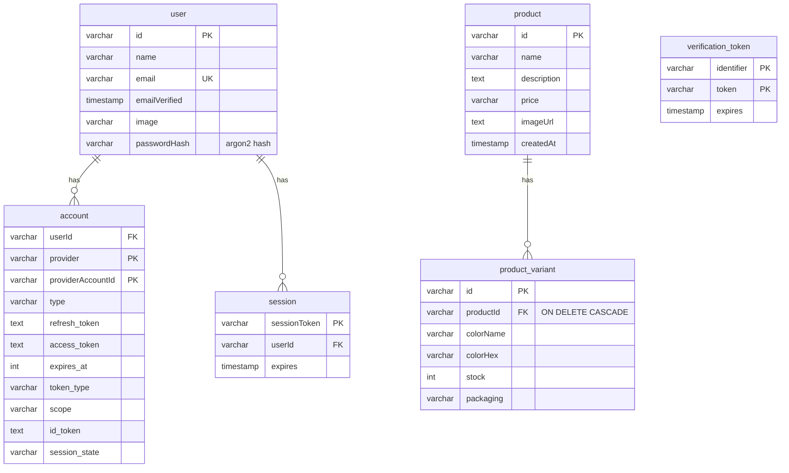

# mm_web

Quotation editor built on the [T3 Stack](https://create.t3.gg/) — Next.js 16 (App
Router), NextAuth / Auth.js (email + password), tRPC, Drizzle ORM, Tailwind CSS,
and PostgreSQL. A signed-in user browses a product catalog, selects products, and
assembles a printable quotation in a Konva-based canvas editor with PDF export.

## Tech stack

- **Next.js 16** (App Router, React Server Components, standalone output)
- **NextAuth v5 / Auth.js** — credentials (email + password) with argon2 hashing,
  JWT session strategy
- **tRPC v11** — end-to-end typesafe API, backed by TanStack React Query
- **Drizzle ORM** + **PostgreSQL** — schema, migrations, and queries
- **Konva / react-konva** + **jsPDF** — canvas editor and PDF export
- **Tailwind CSS v4**

## Architecture

```
src/
├── app/                      Next.js App Router (routes + UI)
│   ├── page.tsx              "/"  — login form (signed out) / product catalog (signed in)
│   ├── login/                "/login" standalone login page
│   ├── editor/               "/editor" Konva quotation editor + PDF export
│   ├── _components/          shared UI (nav bar, login form, product card, …)
│   └── api/                  route handlers: tRPC catch-all + NextAuth
├── server/                   server-only code
│   ├── auth/                 NextAuth config (JWT strategy, credentials provider)
│   ├── db/                   Drizzle client + schema
│   └── api/                  tRPC routers (the business layer)
├── trpc/                     tRPC client wiring (server caller + React provider)
├── lib/                      framework-agnostic helpers (localStorage selection)
└── styles/                   Tailwind entry
```

### Routes

| Route     | Auth        | Description                                            |
| --------- | ----------- | ------------------------------------------------------ |
| `/`       | public      | Login form when signed out; product catalog when in    |
| `/login`  | public      | Standalone login page                                  |
| `/editor` | signed-in   | Quotation canvas editor with undo/redo and PDF export  |

> Note: after a successful login you land on `/` (the catalog). The editor is
> reached from the nav bar / the floating "go to quotation" bar — there is no
> automatic redirect to `/editor`.

## Database schema

Two logical groups share one database:

- **Auth tables** (`user`, `account`, `session`, `verification_token`) — the
  NextAuth / Auth.js Drizzle adapter schema. `user.passwordHash` (argon2) backs
  credentials login.
- **Catalog tables** (`product`, `product_variant`) — products shown on the home
  page, each with color/stock variants.

All tables are physically prefixed with `mm_web_` (Drizzle multi-project schema).



> `verification_token` has no foreign key (it is keyed by `identifier` + `token`)
> and so stands alone.

## Run everything with one command (Docker)

Requires Docker with Compose v2 (`docker compose`).

`AUTH_SECRET` is **required** — there is no committed default (it is the key that
signs/encrypts session tokens). Generate one and pass it in:

```bash
AUTH_SECRET="$(openssl rand -base64 33)" docker compose up --build
```

This will:

1. Start PostgreSQL (data persisted in the `db-data` volume).
2. Wait for the database to be healthy, then apply Drizzle migrations.
3. Start the Next.js app on http://localhost:3000 once migrations succeed.

The app opens on the **login page** (`/`). After signing in you see the **product
catalog**; open the **editor** (`/editor`) from the nav bar.

### Create a login user

The app has no public sign-up, so seed a user once the stack is running:

```bash
docker compose run --rm migrate pnpm db:seed you@company.com "your-password" "Your Name"
```

Optionally seed demo catalog products:

```bash
docker compose run --rm migrate pnpm db:seed:products
```

### Configuration

Environment variables read by Compose:

- `AUTH_SECRET` — **required**, no default. NextAuth signing/encryption key.
  Generate with `openssl rand -base64 33`. If missing, `docker compose up` fails
  with a clear message.
- `POSTGRES_PASSWORD` — Postgres password. Defaults to `postgres` for local dev
  only; set a strong value in production.
- `AUTH_URL` — public URL the browser uses (default `http://localhost:3000`).

## Local development (without Docker)

```bash
./start-database.sh   # starts a local Postgres container
pnpm install
pnpm db:migrate
pnpm db:seed you@company.com "your-password" "Your Name"
pnpm dev
```

Ensure `.env` contains a valid `AUTH_SECRET` and `DATABASE_URL` (see `.env.example`).

## Useful scripts

- `pnpm dev` — start the dev server
- `pnpm build` / `pnpm start` — production build and serve
- `pnpm db:generate` — generate a migration from schema changes
- `pnpm db:migrate` — apply migrations
- `pnpm db:push` — push schema directly (dev convenience)
- `pnpm db:seed <email> <password> [name]` — create/update a login user
- `pnpm db:seed:products` — seed demo catalog products
- `pnpm db:studio` — open Drizzle Studio
- `pnpm typecheck` — TypeScript check
- `pnpm lint` / `pnpm lint:fix` — ESLint

See `docs/docker-optimizations.md` for Docker build-performance notes.
```