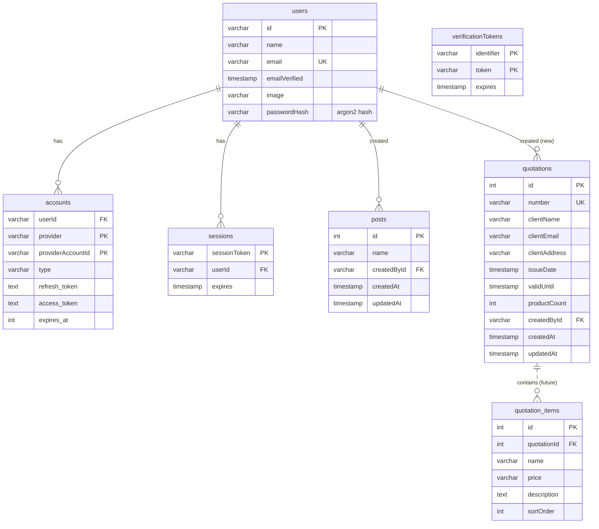

# Next Steps Plan — Quotation Editor

Status: planning. Target branch: a new feature branch off `main` (do **not** work on
`main` directly).

This plan covers four workstreams:

1. Populate quotation pages from an API (mocked to start).
2. A new `quotations` table storing quotation metadata.
3. A database relations diagram (current + intended future shape).
4. An investigation into server-side PDF export vs. the current client-side approach.

---

## 0. Current state (grounding)

What exists today, so the plan builds on reality rather than assumptions:

- **Data population** — `src/app/editor/page.tsx` → `handlePopulateData()` uses a
  hardcoded constant `DUMMY_QUOTATION` (in `template-data.ts`) and passes it to
  `buildPagesFromQuotation(quotation)`, which maps each product to a page and runs
  `interpolate()` to replace `{{placeholders}}`. **The data source is a local
  constant — there is no API call yet.**
- **Types** — `QuotationData` and `Product` are defined in
  `src/app/editor/_components/types.ts`. `Product = { name, price, description }`;
  `QuotationData` adds company + customer fields plus `products: Product[]`.
- **Database** — `src/server/db/schema.ts` uses `createTable = pgTableCreator(name => "mm_web_" + name)`.
  Existing tables are the T3/NextAuth set: `posts` (example), `users`, `accounts`,
  `sessions`, `verificationTokens`. Drizzle `relations()` already wire users↔accounts↔sessions.
- **tRPC** — Router pattern lives in `src/server/api/routers/post.ts`
  (`protectedProcedure` + `zod` input + `ctx.db`). Root router in
  `src/server/api/root.ts` currently only mounts `post`.
- **PDF export** — `src/app/editor/_components/pdf-export.ts` is **fully client-side**:
  it reads the live Konva `stage`, calls `stage.toDataURL()` per page at 2x pixel
  ratio, and assembles a multi-page PDF with jsPDF. This depends on the in-browser
  canvas, so it cannot run on the server as-is.

---

## 1. Populate pages from an API (mocked)

### Goal
Replace the hardcoded `DUMMY_QUOTATION` with data fetched from an API that returns an
array of product objects (each product with its metadata). The API is mocked
initially but shaped so a real backend can drop in later without touching the UI.

### Approach — tRPC procedure backed by a mock (recommended)
The stack already has tRPC wired end-to-end; use it rather than inventing a REST
endpoint, so the client gets type-safety for free and swapping the mock for a real
source is a one-file change.

**Steps**
1. **Define the product/quotation contract with Zod** (single source of truth).
   Create `src/server/api/schemas/quotation.ts`:
   - `productSchema` = `{ name, price, description, ...future metadata (sku, qty, unit, currency) }`
   - `quotationSchema` = company/customer fields + `products: productSchema[]`
   - Export inferred TS types and reconcile with the existing
     `Product` / `QuotationData` in `types.ts` (make `types.ts` re-export the
     inferred types, or vice versa, so there is ONE definition).
2. **Mock data module** — `src/server/api/mocks/quotation-mock.ts` returns a
   `quotationSchema`-valid object (seed it from today's `DUMMY_QUOTATION` so output
   is unchanged at first). Keep this the ONLY place the mock lives.
3. **Router** — `src/server/api/routers/quotation.ts`:
   - `getMock: publicProcedure.query()` → returns the mock (phase 1).
   - Later: `getById: protectedProcedure.input({ id }).query()` reads from DB (phase 2, ties into §2).
   - Mount it in `root.ts`: `createTRPCRouter({ post, quotation })`.
4. **Client wiring** — in `page.tsx`, replace the `DUMMY_QUOTATION` constant in
   `handlePopulateData` with a tRPC query. Because `buildPagesFromQuotation` already
   takes a `QuotationData`, the only change is *where the object comes from*:
   - Use `api.quotation.getMock.useQuery()` (or the server-side caller) and pass the
     result into `buildPagesFromQuotation`.
   - Add loading / error UI on the "Populate Data" button (disable + spinner while
     fetching, surface errors like the existing export error handling).
5. **Swap-in path (future)** — replacing the mock with a real API means changing only
   the resolver body in `quotation.ts` (e.g. `fetch()` an upstream service or query
   the DB). UI and page-building logic stay untouched.

### Alternative considered
A plain Next.js Route Handler (`src/app/api/quotation/route.ts`) returning JSON. Works,
but loses tRPC's end-to-end types and duplicates validation. **Not recommended** given
tRPC is already the app's data-fetching backbone.

### Acceptance criteria
- Clicking "Populate Data" fetches from the tRPC `quotation` router (mock) and renders
  identical output to today.
- Product shape is defined once (Zod) and reused by client, server, and DB.
- Swapping the mock for a real source requires editing only the resolver.

---

## 2. New `quotations` metadata table

### Goal
Store quotation metadata: number, client data, dates, and number of products.

### Schema (Drizzle, in `src/server/db/schema.ts`)
Follow the existing `createTable("...")` convention (auto-prefixes `mm_web_`).

Proposed `quotations` table:

| Column          | Type                         | Notes                                        |
|-----------------|------------------------------|----------------------------------------------|
| `id`            | integer, PK, generated       | Matches `posts` id style                     |
| `number`        | varchar(64), unique          | Human-facing quotation number (e.g. Q-2026-0001) |
| `clientName`    | varchar(255), not null       | Client data                                  |
| `clientEmail`   | varchar(255)                 |                                              |
| `clientAddress` | varchar(512)                 |                                              |
| `issueDate`     | timestamp(tz), not null      | Quotation date                               |
| `validUntil`    | timestamp(tz)                | Expiry (policies say 30 days)                |
| `productCount`  | integer, not null, default 0 | "number of products"                         |
| `createdById`   | varchar(255), FK → users.id  | Owner (mirrors `posts.createdById`)          |
| `createdAt`     | timestamp(tz), default now   | Mirrors `posts`                              |
| `updatedAt`     | timestamp(tz), $onUpdate     | Mirrors `posts`                              |

Indexes: `number` (unique), `createdById`, `issueDate`.

**Design decision — products storage:** the request specifies storing the *count* of
products in the quotation metadata, not the products themselves. Phase 1 stores
`productCount` only. A future `quotation_items` table (see diagram, dashed) can hold
the individual products when persistence of line items is needed — that is when
`productCount` becomes a derived/maintained value.

Add a `quotationsRelations` (one `user` → many `quotations`) and extend
`usersRelations` with `quotations: many(quotations)`.

### Migration
- `pnpm db:generate` to produce the SQL migration, `pnpm db:migrate` (or the
  `migrate` compose service) to apply. Verify no drift on existing tables.

### Router/CRUD (ties into §1 phase 2)
Add to `quotation.ts`: `list`, `getById`, `create`, `update` (`protectedProcedure`,
scoped by `createdById = ctx.session.user.id`, using `drizzle` where-clauses — note the
repo's eslint rule `drizzle/enforce-*-with-where`).

### Acceptance criteria
- `quotations` table created via migration, prefixed `mm_web_quotation`.
- Relation to `users` in place; `pnpm db:generate` shows no unexpected drift.
- Can insert/read a quotation metadata row scoped to the logged-in user.

---

## 3. Database relations diagram

Current tables are the auth set + example `posts`. The new `quotations` table (§2) and
a **future** `quotation_items` table (dashed = not built yet) are included so the model
shows intended direction.

Legend:
- Solid line = relation that exists (or will exist once §2 lands).
- `||..o{` dashed to `quotation_items` = **future** table, not yet planned for build.
- `verificationTokens` has no FK relation (standalone, by NextAuth design).

Note: real table names are prefixed `mm_web_` at the DB level (e.g. `mm_web_quotation`);
the diagram uses logical names.

---

## 4. Server-side PDF export — investigation

### Why it's being considered
Today's export (`pdf-export.ts`) is 100% client-side: it reads the live Konva stage in
the browser (`stage.toDataURL()`) and builds the PDF with jsPDF. That means the PDF is a
set of **raster images** (PNG snapshots), and generation depends on the user's browser.

### Potential benefits of server-side
- **Vector / selectable text** — a server renderer (e.g. Playwright/Chromium printing an
  HTML representation, or a PDF lib like `pdfkit`/`react-pdf`) can emit real text, giving
  smaller files, selectable/searchable text, and crisper output than 2x PNGs.
- **Consistency** — output no longer depends on the client's screen DPI, fonts, or browser.
- **Automation** — enables emailing/archiving quotations, batch export, or generating a
  PDF from stored data (§2) without opening the editor.
- **Offload work** — heavy documents don't freeze the user's tab.

### Costs / challenges
- **Rendering parity is the hard part.** The canvas is a Konva scene. To render it
  server-side you must either:
  - (a) Run headless Chromium (Playwright) that reproduces the Konva stage — heavy
    dependency, big container image, needs the same client code to run server-side; or
  - (b) Re-implement the layout as **HTML/CSS** (or a `@react-pdf/renderer` document)
    driven by the same `PageData`/`QuotationData` model, and render THAT on the server.
    Option (b) is the clean long-term path and pairs naturally with §1/§2 (generate a
    PDF straight from stored quotation data), but it means maintaining a second renderer
    that must match the canvas visually.
- **Infra** — Playwright/Chromium in the Alpine container is non-trivial (extra system
  libs, larger image). `@react-pdf/renderer` is pure JS (lighter) but won't match the
  free-form drag/resize canvas pixel-for-pixel.
- **Current export already works** and is free of server cost.

### Recommendation
- **Short term:** keep client-side export. It works and matches the WYSIWYG canvas exactly.
- **Medium term:** if selectable-text PDFs, server automation, or "export from saved data
  without opening the editor" become requirements, build a **server renderer from the
  data model** (option b, `@react-pdf/renderer`) as a tRPC mutation / route handler that
  takes a quotation id (§2) and streams a PDF. Treat the canvas as the *interactive
  editor* and the server renderer as the *canonical output* — accept that they are two
  representations of the same `QuotationData`.
- **Decision gate:** only invest here once §1 (API data) and §2 (persistence) exist,
  because server-side rendering is only valuable when there's stored data to render from.

### Spike (time-boxed, before committing)
1. Prototype a `@react-pdf/renderer` document that renders one quotation from
   `QuotationData` (no canvas) → compare visual fidelity & file size vs. current export.
2. Measure image size impact and Alpine container image size delta if Playwright is
   trialled.
3. Decide option (a) vs (b) vs. status quo based on the fidelity/effort trade-off.

---

## Suggested sequencing

1. **§1 phase 1** — Zod contract + mock + tRPC `quotation.getMock` + wire "Populate
   Data" to it (no DB yet). Low risk, immediate value, unblocks everything else.
2. **§2** — add `quotations` table + migration + basic CRUD router.
3. **§1 phase 2** — point populate/list at the DB instead of the mock.
4. **§4 spike** — evaluate server-side PDF only after data is persisted.

Each step: branch off `main`, verify with `pnpm typecheck && pnpm lint && pnpm build`,
and confirm the Docker stack still serves (`pnpm docker:up:build`).
